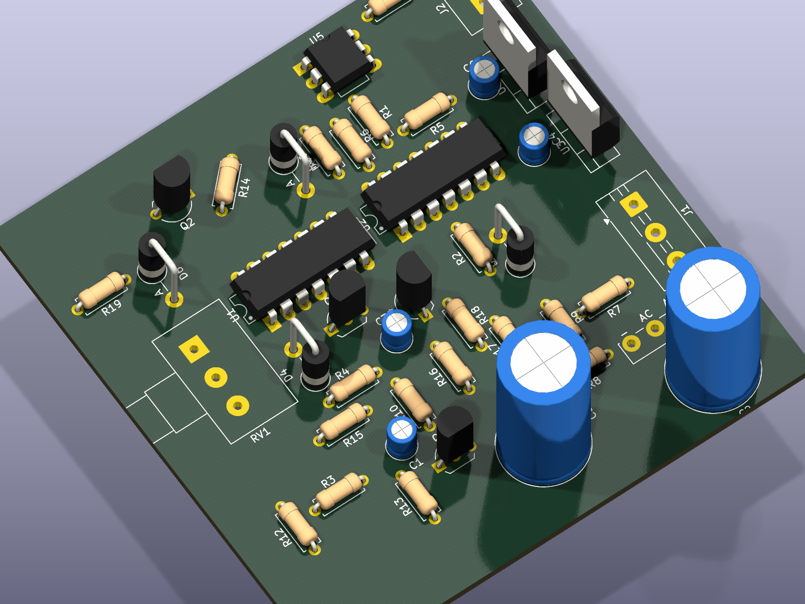
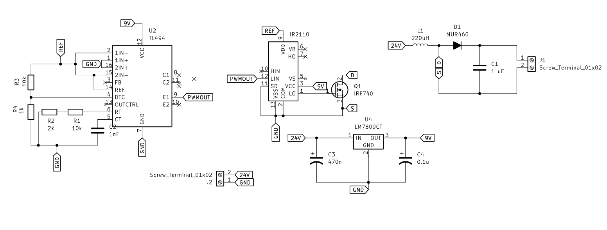
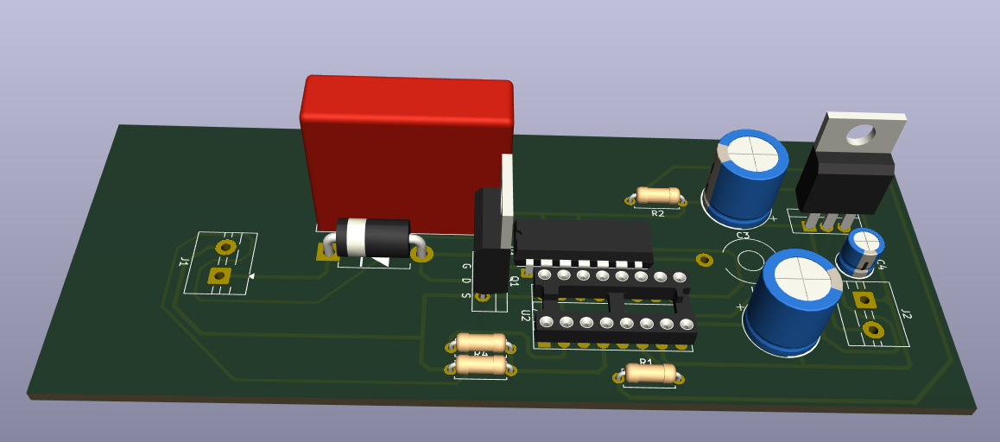
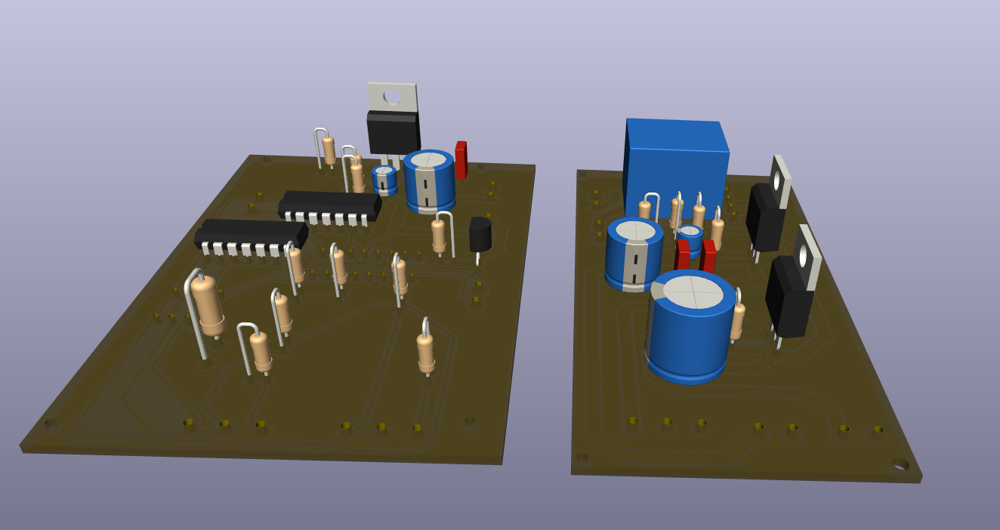
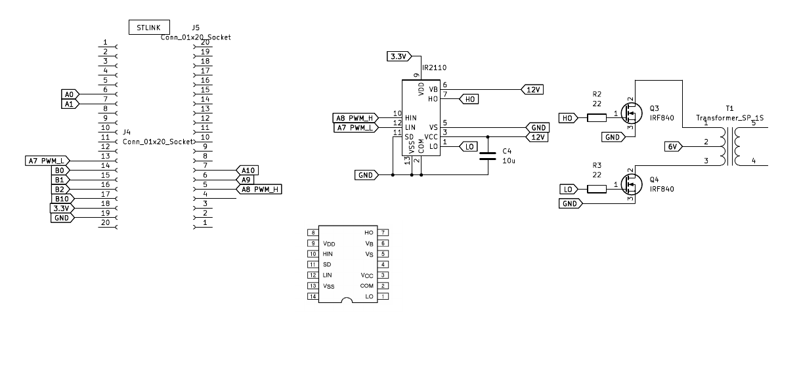

# Power Electronics PCBs

Power electronics boards from coursework — physical PCB designs, not just simulation. Each folder is a separate board with its own schematic/layout, a 3D render, and (coming soon) real photos of the built board.

| | Project | What it is |
|---|---|---|
|  | [`scr-controller/`](scr-controller/) | SCR/thyristor phase-control firing board |
|  | [`buck-converter-24-120v/`](buck-converter-24-120v/) | Buck converter, 24 V input target |
|  | [`classd-amplifier-stm32/`](classd-amplifier-stm32/) | Class D amplifier, STM32-controlled switching |
|  | [`power-supply-protected/`](power-supply-protected/) | Voltage supply with short-circuit protection (power + control boards) |
|  | [`ac-dc-inverter/`](ac-dc-inverter/) | AC-DC inverter |

All of these were built as coursework together with [Iker Garcia](https://github.com/IKGB105) [DasReyxr](https://github.com/DasReyxr) and [Kevin Lara](https://github.com/Gyonyu) — the original combined project history lives in [DasReyxr/HW-Projects](https://github.com/DasReyxr/HW-Projects). This repo pulls out just the PCB projects, one per folder, with proper writeups and renders instead of a mixed dump of exam/simulation files.
