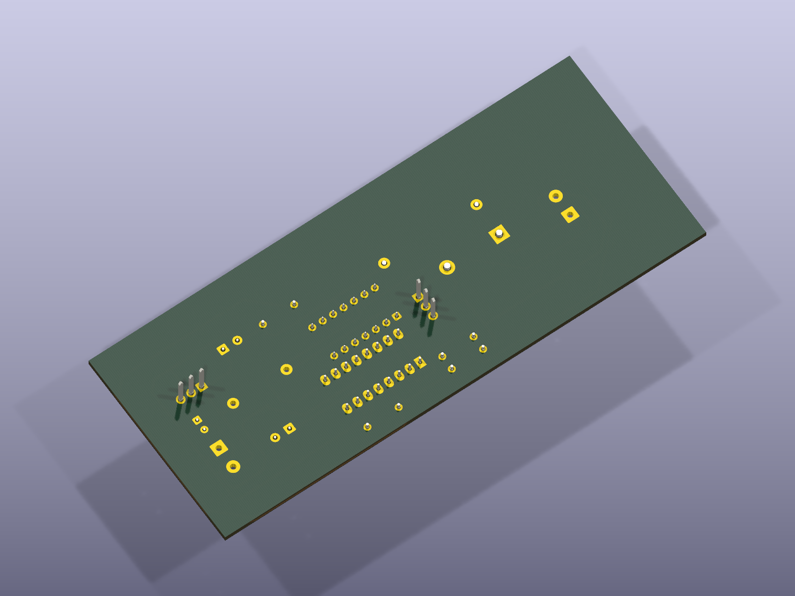

# Buck Converter (24 V &rarr; 120 V design exam)

A buck converter built for a power electronics exam. (Note: the source repo's folder was mislabeled "BoostConverter" — this is a buck design.)

**Photos of the built board — coming soon**

## Files
- `BuckConverter.kicad_sch` / `.kicad_pcb` / `.kicad_pro` — KiCad design
- `Schematic.pdf` — schematic printout
- `simulation.asc` — LTspice simulation

## Credit
Built as coursework with [DasReyxr](https://github.com/DasReyxr)  and [Kevin Lara](https://github.com/Gyonyu) — original project history in [DasReyxr/HW-Projects](https://github.com/DasReyxr/HW-Projects). This copy is curated separately with a proper writeup and renders.
