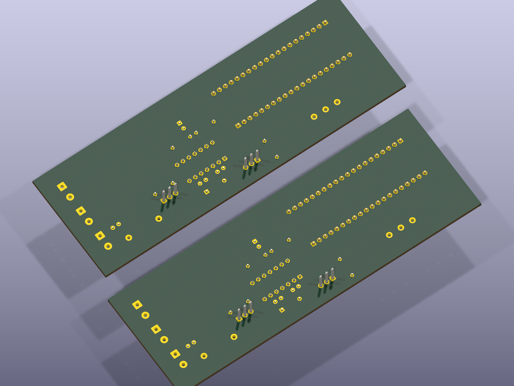

# Class D Amplifier with STM32 (DSP Control)

A Class D audio amplifier with an STM32 handling the switching/DSP side, not just the analog power stage. Two firmware targets exist: the main board runs an STM32H523xx, and there's a second variant built around a "Blackpill" STM32F411 board.

**Photos of the built board — coming soon**

## Files
- `ClassDAmplifier.kicad_sch` / `.kicad_pcb` / `.kicad_pro` — KiCad design
- `ClassD.pdf` — design writeup
- `firmware-CLASSDAMPLIFIER-H5/` — STM32H523xx firmware (Core sources + .ioc)
- `firmware-CLASSD-BLACKPILL-F411/` — STM32F411 Blackpill firmware variant (Core sources + .ioc)

## Credit
Built as coursework with [DasReyxr](https://github.com/DasReyxr)  and [Kevin Lara](https://github.com/Gyonyu) — original project history in [DasReyxr/HW-Projects](https://github.com/DasReyxr/HW-Projects). This copy is curated separately with a proper writeup and renders.
