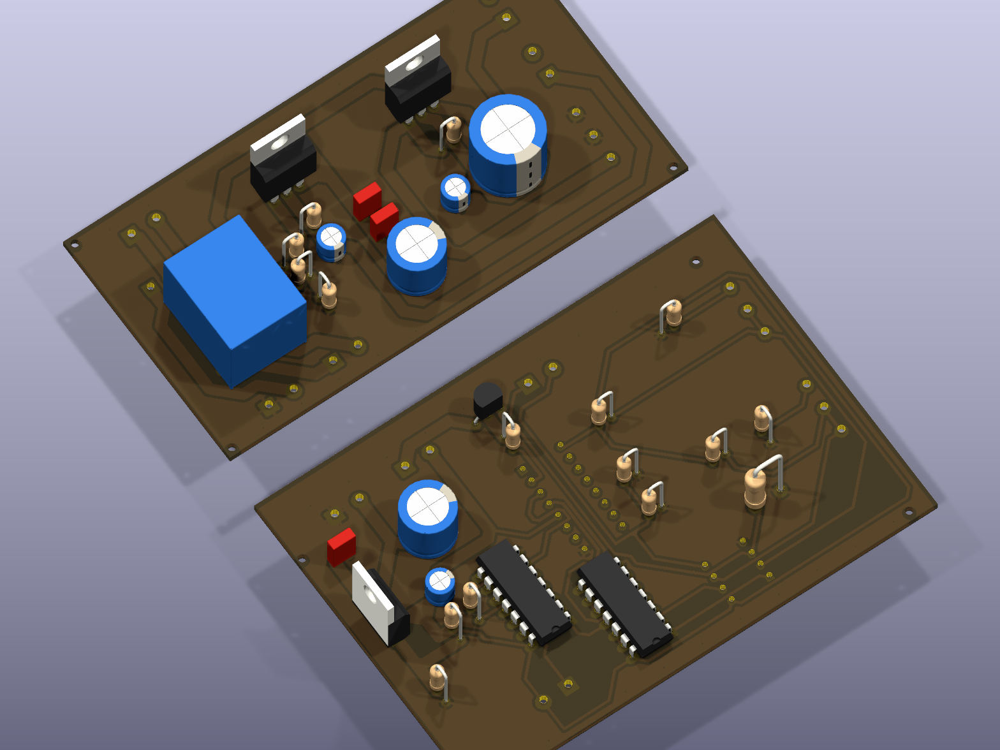
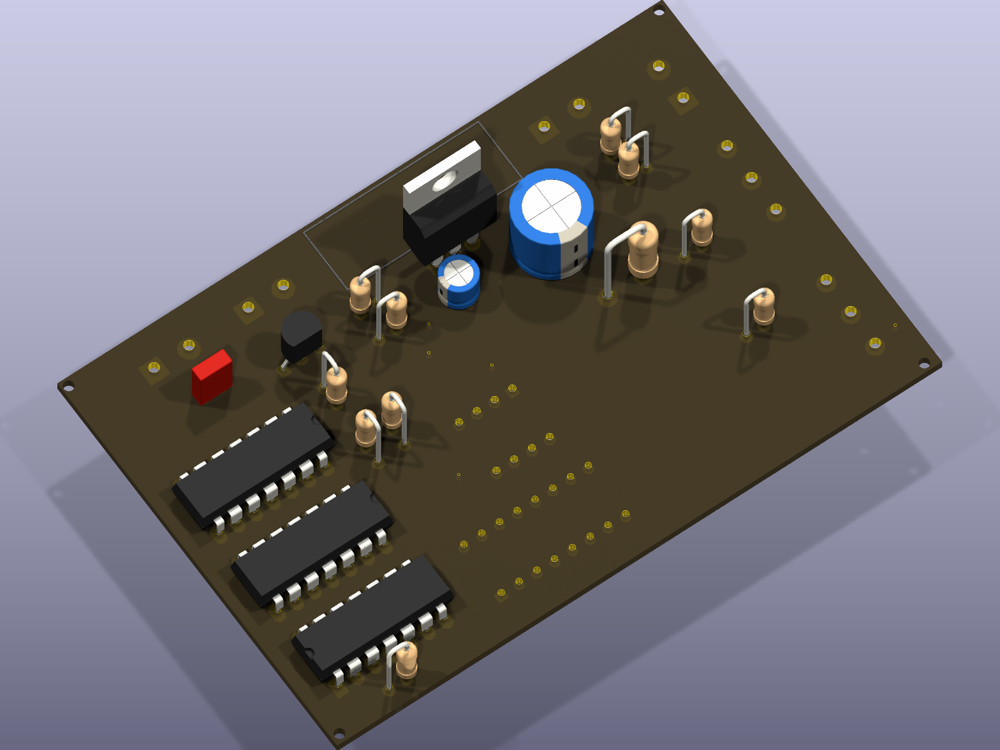

# Protected Voltage Supply (Two-Board System)

A voltage supply with short-circuit protection, split across two boards: a **power stage** (the actual supply, fully routed with fabrication-ready Gerbers) and a **control stage** (protection/sensing logic built around a CD4043BE tri-state buffer).

## Power stage

## Control stage

**Photos of the built boards — coming soon**

## Files
- `power-stage/` — `SCH_PowerSupply.kicad_*`, full Gerbers + drill files in `gerbers/`, PDF writeup
- `control-stage/` — `CONTROL_PowerSupply.kicad_*`, CD4043BE symbol
- `Power_Supply.pdf` — overall design writeup

## Credit
Built as coursework with [DasReyxr](https://github.com/DasReyxr) — original project history in [DasReyxr/HW-Projects](https://github.com/DasReyxr/HW-Projects). This copy is curated separately with a proper writeup and renders.
